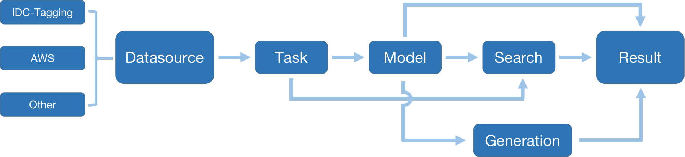
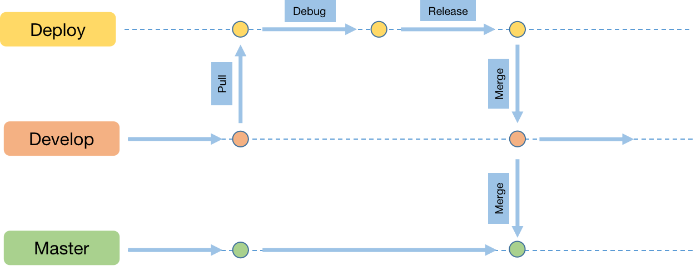

## NAM

蔚来（NIO）自动数据挖掘

## 体系结构
1. Base functions
    <div align="center">
    
    </div>


## Install
1. install using source code
    ```shell
    python3 setup.py develop --user
    ```


## Develop
1. Class Relation
    <div align="center">
    
    </div>

2. When coding set 'NAM_LOC' as local
    ```shell
    export NAM_LOC=local
    ```
    if use nam with datafilter, NAM_LOC will get value from 'LOCATION'

2. When coding, set 'NAM_RUN' as debug
    ```shell
    export NAM_RUN=debug
    ```
    when NAM_RUN=debug, will print some key info like execute procedure

3. When do step debug, can use 'self.debugger' [doc](https://docs.python.org/3.8/library/pdb.html)
    ```shell
    self.debugger.set_trace()
    ```

4. When Profile, use @profile_time(), @profile_execute(), @profile_memory to test run time, call, memory
    ```shell
    @profile_time()
    def test_od3d():
        ***
    ```
5. Git Branch 
    <div align="center">
    
    </div>
    use develop branch to add new feature, use deploy branch to fix error of master before release.

6. When push code, use pre-commit [doc](https://pre-commit.com/#install)


## WorkFlow
1. Task
    <div align="center">
    
    </div>

2. prepare clip-list and store in workdirs/cliplist/***.txt 

3. download clip using clip-list

    ```shell
    ./scripts/task.sh download_clip configs/data/data_processed.py
    ./scripts/task.sh download_clip configs/data/data_raw.py
    ```

4. generate model tag for clip

    ```shell
    ./scripts/task.sh tag_clip configs/model/od2d_triton.py
    ```

5. mining data using model tag

    ```shell
    ./scripts/task.sh search_clip configs/search/od2d_p.py
    ```
